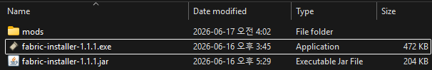
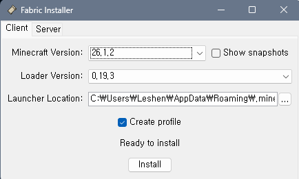
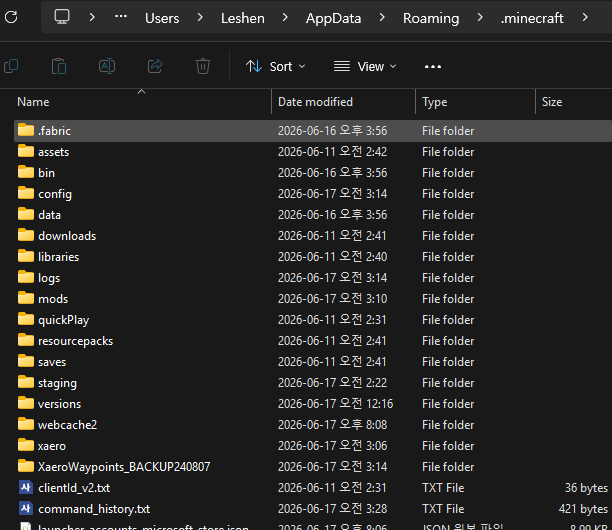
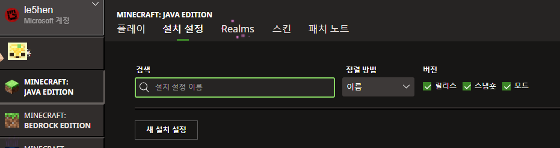
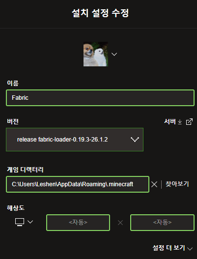
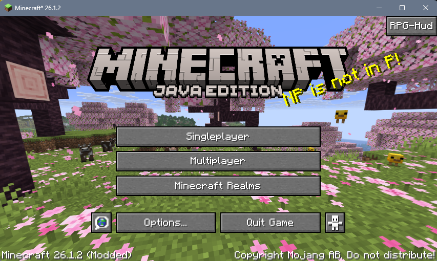
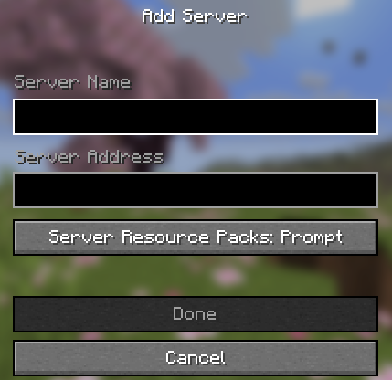
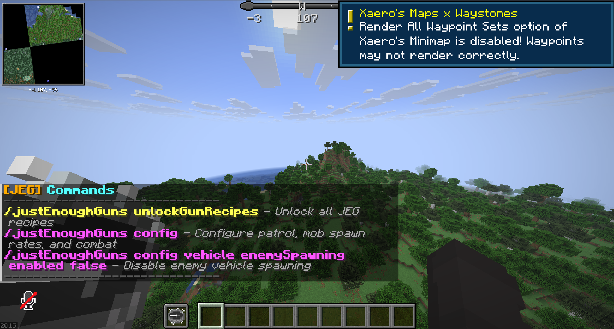

# HAC Minecraft Server Introduction

## 서버 정보

현재 HAC Minecraft 서버는 `Java Edition 26.1.2`를 기준으로 개설된 서버임. (작성일자 26.06.16 기준)

| 항목 | 값 |
|---|---|
| Minecraft | 26.1.2 |
| Loader | Fabric |
| 메모리 | 5GB |
| 음성 채팅 | Simple Voice Chat |
| 서버 형태 | 탐험 + 생활 + 건축 |

## Mod List

서버의 관리와 모딩의 용이함을 위해 Fabric을 통해 구축하였고, 총 75개의 모드가 현재 설치되어 있음.

설치된 모드들의 목록은 [모드 목록](MOD_META.md)에서 보면 됨.

### 모드 수량

|분류|개수|
|---|---:|
|핵심 라이브러리|21|
|성능 최적화|9|
|탐험 및 월드 생성|9|
|이동 및 편의성|13|
|농사 및 음식|5|
|RPG 및 전투|6|
|지도 및 HUD|9|
|정보 조회|2|
|멀티플레이|1|
|**총합**|**75**|

---

## How To Enter

서버에 입장하기 위해서 우선 정품 마인크래프트 런처를 소유하고 있다는 점을 가정하고 설명하겠음.

가장 먼저 그냥 런처를 실행해서 Java Edition의 최신 릴리스가 플레이 가능한 상태인지 확인하고 진행하는 것이 필요함.

Fabric을 통해 구축한 서버이기 때문에 클라이언트 단에서도 동일한 환경 설정이 필요함.

## Requirements Installation

### 1. `requirements.zip` 다운로드

최초로 서버에 입장하기 위해서는 우선 모드팩의 역할을 하는 [requirements.zip](https://github.com/S0rrow/HAC_MinecraftServer/releases)을 다운로드 받아야 함.

이미 기존에 서버에 입장했었다면, [mod_updates.zip](https://github.com/S0rrow/HAC_MinecraftServer/releases)만 다운로드 받은 뒤, 기존에 모드들이 설치된 경로에 `mods_updates` 디렉토리 내부의 파일들을 옮겨주면 됨.

`requirements.zip` 파일 내부에는 `fabric installer`와 `mods` 디렉토리가 존재함.



---

### 2. fabric installer 실행.

`requirements.zip`의 압축을 해제하고 내부의 fabric installer라는 파일을 실행해야 함.

해당 파일은 fabric profile을 생성하기 위한 실행 파일임.

주의할 점으로 fabric installer를 실행하기 전에 마인크래프트 게임과 런처가 실행중이라면 종료하고 진행해야 함.



실행하면 Client 탭을 보면 되는데, Minecraft Version, Loader Version, Launcher Location이 나오며, 크게 건드리지 않는다면 대부분 최신 버전으로 잡혀있을거임.

작성일 26.06.16 기준으로 버전 정보는 다음과 같음.

```
Minecraft Version   : 26.1.2
Loader Version      : 0.19.3
```

Launcher Location의 경우 Windows 기준으로 `%APPDATA%\.minecraft`로 잡힐텐데, 해당 경로를 잘 기억해두셈.

문제가 없다면 Create Profile에 체크박스를 체크하고 Install 버튼을 눌러 설치를 진행하면 됨.

---

### 3. mods 디렉토리 복사

파일 관리자를 열어서 Launcher Location에서 설정한 위치로 이동하게 되면 여러 디렉토리들이 나올 거임.



기본적으로는 `.minecraft`라는 이름의 디렉토리임.

이 `.minecraft` 디렉토리 아래에 `requirements` 내부의 `mods` 디렉토리를 복사 & 붙여넣기 해주면 됨.

---

### 4. Fabric Profile 설치

Fabric 설정이 끝나면 이제 마인크래프트 런처를 실행하면 됨.

좌측 Minecraft: Java Edition 버튼을 눌러서 Java Edition 화면으로 진입하셈.



그 후, 설치 설정으로 들어가서 새 설치 설정 버튼을 눌러주셈.

이때, 이미 `fabric loader`가 1.9.3 버전으로 프로필이 생성되어 있는 경우 굳이 새 설치 설정을 해줄 필요 없이 바로 해당 스냅샷 설정으로 게임을 실행하고 [서버 설정](#5-server-주소-추가)으로 넘어가도 무방함.



이름의 경우 아무렇게나 지어도 무방하나 기존 설정과의 구분을 위해 __Fabric__ 이라고 짓는 것을 추천.

버전의 경우 클릭하게 되면 여러 버전 snapshot이 나오는데, 이중에 `fabric-loader`라는 이름이 붙은 스냅샷을 선택하면 됨.

게임 디렉토리의 경우, 2번에서 설명한 Launcher Location의 정보를 찾아보면 됨.

만약 직접 타이핑하기 귀찮으면 Windows 기준으로 `%APPDATA%\.minecraft` 이 주소를 복사해서 찾아보기 버튼을 누르면 나오는 파일 관리자의 주소창에 치면 됨.

그럼 Windows를 기준으로 하는 경우 `C:\Users\{유저명}\AppData\Roaming\.minecraft` 같은 이름의 디렉토리가, macOS를 기준으로 하는 경우 `/Users/{유저명}/Library/Application Support/minecraft` 같은 이름의 디렉토리로 나오게 될텐데 그걸 그대로 선택하면 됨.

해상도의 경우 자동으로 설정되어 있을텐데 그대로 두면 됨.

저장하고 실행하면 Mod관련 위험 안내가 나오게 될텐데 그 부분은 무시해도 무방함.

문제가 없다면 정상적으로 게임이 실행될 것임.



문제없이 정상적으로 설치가 되었다면 좌하단의 마인크래프트 본 게임 버전 정보 옆에 *Modded* 라는 글자가 같이 있을 거임.

---

### 5. Server 주소 추가

추가적으로 서버 주소의 경우 Discord 채널에 올려둘텐데, 해당 IP로 접속을 시도하면 됨.

마인크래프트 본 게임을 열고 멀티플레이어 버튼을 누른 뒤, Add Server 버튼을 눌러서 새로 서버를 추가하면 됨.



여기서 이름은 아무거나 해도 됨.

주소는 공유된 서버 IP로 입력하면 되고.

모드 파일들이 mods 디렉토리 내부에 잘 배치되었고 fabric launcher로 잘 실행된 상태라면 문제 없이 접속 가능할 것임.

